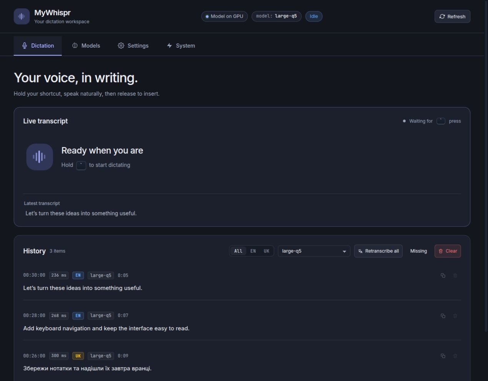
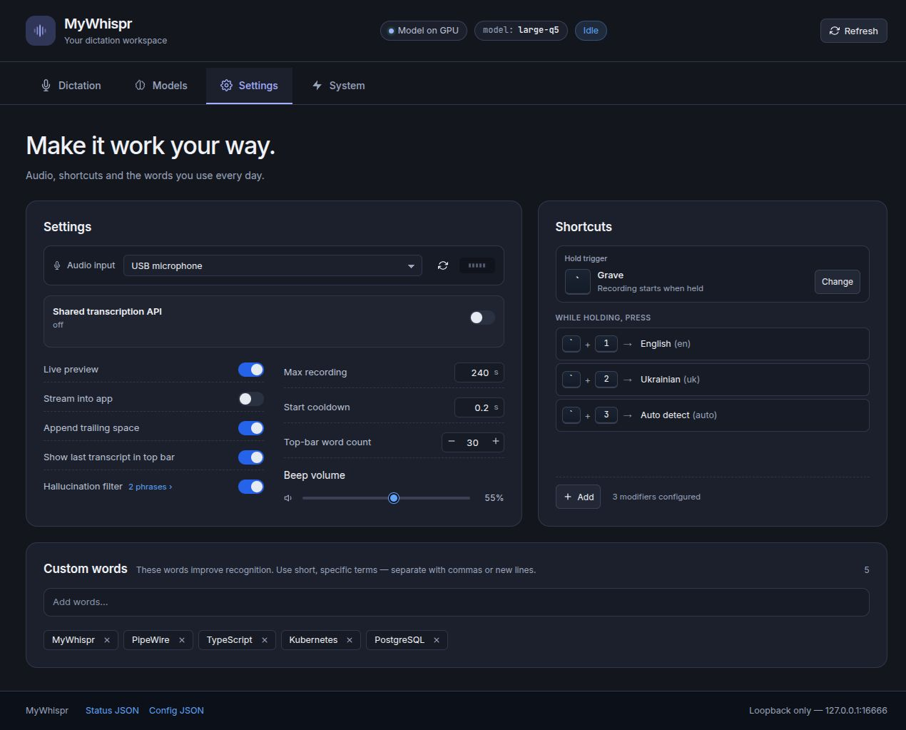

# MyWhispr

MyWhispr is a local hold-to-record dictation daemon for GNOME Wayland.
Hold the configured trigger key, speak, release, and the final transcript is
inserted into the focused app. Audio is recorded locally through PipeWire and
transcribed by local ASR backends by default. External transcription APIs are
available as explicit opt-in model cards.

The local control panel runs at:

```text
http://127.0.0.1:16666/
```

## Screenshots





## What It Does

- Hold-to-record dictation with release-to-insert behavior.
- Configurable trigger key and combo shortcuts from the web UI.
- Live transcript preview while recording.
- Optional streaming into the focused app with guarded backspace/rewrite logic.
- Local history for recent dictations, including in-memory WAV playback.
- Manual retranscription of retained history through another configured model.
- PipeWire input-device selection.
- Custom vocabulary and hallucination phrase filtering.
- GNOME Shell top-bar indicator.
- Local-only HTTP UI bound to `127.0.0.1` by default.

## Platform Support

| Platform | Status | Notes |
|---|---:|---|
| Ubuntu / GNOME / Wayland | Supported target | Main development and test environment. Uses PipeWire, evdev, GNOME shortcuts, `ydotool`, and `wl-copy`. |
| Other Linux Wayland desktops | Possible, not guaranteed | Core pieces may work if PipeWire, `/dev/input`, `ydotool`, and `wl-copy` are available. GNOME shortcut and top-bar integration are GNOME-specific. |
| Linux X11 | Not supported | The app is designed around Wayland-era input and clipboard tools. |
| macOS | Not supported | No recording, hotkey, service, or output backend is implemented for macOS. |
| Windows | Supported (desktop daemon) | Native port: WASAPI recording via `sounddevice`, global hold-to-record hotkey via a low-level keyboard hook, `SendInput`/Win32 clipboard output, `winsound` cues, a system tray icon with state colors, and CUDA GPU transcription through the same worker venv. See "Windows setup" below. |
| WSL / WSLg | Not supported | Global hotkeys, audio capture, and focused-app input are host-desktop problems, not normal WSL process capabilities. |

The app currently works best as a desktop daemon on GNOME Wayland. The code is
being kept portable where practical, but the shipping workflow is Linux-first.

## How Text Gets Inserted

MyWhispr separates transcription from output transport:

- Text is pasted through the clipboard first for fast bulk insertion.
- If clipboard paste fails, short printable ASCII text can fall back to the
  synthetic-input backend.
- On Linux Wayland, output uses `ydotool` plus `wl-copy --paste-once`.
- On Windows, the output backend maps the same operations to `SendInput` and
  the Win32 clipboard.

This is intentionally content-agnostic. MyWhispr does not special-case phrases
or leading words to decide whether insertion should work.

## Requirements

For the supported Linux/GNOME/Wayland setup:

- Python 3.10+.
- PipeWire tools: `pw-record` and `pw-play`.
- Wayland clipboard tool: `wl-copy` from `wl-clipboard`.
- Synthetic input tool: `ydotool` and a working `ydotoold` service/socket.
- Python packages used by the daemon: `aiohttp`, `evdev`, and `pyudev`.
- Read access to the selected `/dev/input/event*` keyboard devices.
- A local `whisper.cpp` server binary for whisper.cpp models.
- Optional GPU ASR Python environments for Hugging Face / NeMo models.

On Ubuntu-style systems:

```bash
sudo apt install pipewire-bin wl-clipboard ydotool python3-evdev python3-pyudev python3-aiohttp
```

## Install

### Windows

Clone the repo, then run the installer from PowerShell:

```powershell
git clone https://github.com/ibmua/MyWhispr.git
cd MyWhispr
PowerShell -ExecutionPolicy Bypass -File .\scripts\install-windows.ps1
```

The Windows installer is idempotent. It creates `.venv`, `.venv-gpu-asr`, and
an isolated `.venv-qwen-asr` runtime, installs runtime dependencies, downloads
the whisper.cpp CUDA server build (for the quantized GGML Whisper models),
writes a working `config.json`, downloads the default Parakeet model into the
Hugging Face cache, and then stops. Qwen runs in its own virtualenv because its
package pins an older Transformers release than Parakeet needs. The installer
does not create startup entries or launch a hidden background process unless
you ask it to.

Start MyWhispr when setup is done:

```powershell
.\bin\mywhisprd.cmd
```

Then open the control panel:

```text
http://127.0.0.1:16666/
```

Optional installer switches:

```powershell
# Set up Python environments and config without downloading model weights.
PowerShell -ExecutionPolicy Bypass -File .\scripts\install-windows.ps1 -SkipModelDownload

# Skip the optional isolated Qwen runtime.
PowerShell -ExecutionPolicy Bypass -File .\scripts\install-windows.ps1 -SkipQwenBackend

# Launch MyWhispr after setup.
PowerShell -ExecutionPolicy Bypass -File .\scripts\install-windows.ps1 -Start

# Create Start Menu and login startup shortcuts.
PowerShell -ExecutionPolicy Bypass -File .\scripts\install-windows.ps1 -CreateStartMenuShortcut -CreateStartupShortcut

# Skip the ~460 MB whisper.cpp CUDA server download (GGML models stay disabled).
PowerShell -ExecutionPolicy Bypass -File .\scripts\install-windows.ps1 -SkipWhisperServer
```

Older `-NoStart` and `-NoStartupShortcut` flags are still accepted for scripts
that already use them, but starting and startup shortcuts are now opt-in.


Whisper.cpp GGML models (including the quantized Whisper Large v3 Q5) download
with one click from the web UI once `whisper_server_binary` points to a
`whisper-server.exe`; the installer sets this up automatically. If the binary
is missing the cards stay visible but disabled, avoiding the first-run trap
where a local model file exists but no server executable can run it.

**Antivirus note:** the prebuilt `whisper-server.exe` is unsigned, and some
antivirus products (notably Avast/AVG with a generic `IDP.Generic` verdict from
"behavior analysis") silently freeze its network threads or quarantine it. The
symptom is a GGML model that loads but never becomes ready. Add an exclusion
for the MyWhispr folder in your antivirus settings; the Python-based GPU models
(Parakeet, Qwen, etc.) are unaffected.

### Linux / GNOME

```bash
git clone https://github.com/ibmua/MyWhispr.git
cd MyWhispr
cp config.example.json config.json
./scripts/install.sh
```

Open the local UI:

```bash
xdg-open http://127.0.0.1:16666/
```

## Windows Notes

The installer sets `"gpu_asr_python": "./.venv-gpu-asr/Scripts/python.exe"` and
uses `parakeet-tdt-0.6b-v3` as the first-run default. Qwen model entries point
at `./.venv-qwen-asr/bin/python`, which resolves to the Windows
`Scripts\python.exe` path at runtime. Workers use offline model loading, so the
installer downloads Parakeet during setup by default and the UI downloader
caches additional model weights before loading them. The tray icon shows daemon
state; the trigger key from `triggers` (grave by default) is captured by a
global keyboard hook, so it does not type into the focused app.

## Daily Use

The default workflow is:

1. Focus any text field, terminal, editor, or chat box.
2. Hold the configured trigger key.
3. Speak.
4. Release the trigger key.
5. MyWhispr transcribes locally and inserts the final text into the focused app.

Combo shortcuts can switch language or mode while the trigger is held. For
example, a setup can use one combo key for English, another for Ukrainian, and
another for non-streaming dictation.

You do not have to wait for the previous take to finish: as soon as the trigger
is released the next press starts a new recording immediately, while the
previous recording is transcribed and inserted in the background. Takes queue
up and land in the order they were spoken; the web UI header shows how many are
still in flight.

## Commands

```bash
systemctl --user status mywhisprd --no-pager
journalctl --user -u mywhisprd --no-pager -n 120
./bin/mywhisprctl status
./bin/mywhisprctl start grave
./bin/mywhisprctl stop
```

## Models

Whisper.cpp GGML models can be stored in `models/`:

```bash
./scripts/download-model.sh large-v3-q5_0
```

Configured Hugging Face / NeMo GPU ASR models can be downloaded into the local
HF cache:

```bash
./scripts/download-gpu-asr-model.sh parakeet-tdt-0.6b-v3
./scripts/download-gpu-asr-model.sh qwen3-asr-0.6b
./scripts/download-gpu-asr-model.sh canary-1b-v2
```

The included model catalog covers whisper.cpp models plus GPU ASR backends for
Qwen, Parakeet, Canary, Cohere, Granite, and Seamless M4T. The web UI can also
add external API models. The default API template is `remote-large-q5`, a LAN
whisper.cpp Large Q5 server at `http://192.168.50.100:18178/inference`; OpenAI
transcription models are also available if an API key is configured. Model
weights, virtualenvs, local config, and transcript scratch files are
intentionally ignored by git.

The Settings panel can also expose this MyWhispr instance as an authenticated
LAN transcription API. When enabled, it serves OpenAI-style multipart
transcriptions and shows copyable client JSON that another MyWhispr instance can
paste into its API model configuration.

## Architecture

MyWhispr is split into small local components:

- `mywhispr/daemon.py`: state machine, recording lifecycle, history, config,
  and final paste orchestration.
- `mywhispr/recorder.py`: PipeWire recording.
- `mywhispr/transcriber.py`: final ASR requests and text cleanup.
- `mywhispr/streaming.py`: live preview and optional app-output streaming.
- `mywhispr/paste.py`: platform output backend for typing, paste, copy, and
  backspace.
- `mywhispr/web.py` and `webui/`: local control-panel API and React UI.
- `extensions/mywhispr@local/`: GNOME Shell top-bar indicator.

The detailed implementation plan and design constraints live in
`REWRITE_DESIGN.md`.

## Privacy And Safety

- The daemon does not send audio to cloud APIs unless an external API model is
  explicitly selected.
- The default history is RAM-only and disappears when the daemon restarts.
- Temporary recordings live under `/run/user/$UID`, which is tmpfs on typical
  Linux desktops.
- The web UI binds to `127.0.0.1` by default.
- The shared transcription API is disabled by default and requires an API key
  before it can start.
- Transcript text is not logged by default.
- Config and custom words live in `config.json`; treat that file as
  user-confidential.

## Known Limits

- The web UI is desktop-oriented. It is not currently designed as a mobile UI.
- GNOME integration is first-class; other desktops may need launcher or shortcut
  work.
- Windows has an output backend scaffold, not a full supported release.
- Non-ASCII dictation uses the paste fallback by default because direct typing
  is limited to short printable ASCII text on the current Linux path.
